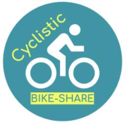

# Google Data Analyst Professional Certificate Program Case Study

## Introduction
This project is a Case Study hosted by the Google Data Analyst Professional Certificate Program. In this case study, I take on the role of a marketing junior data analyst working for Cyclistic, a fictional bike sharing company located in Chicago, Illinois.

## Problem Statement
**Cyclstic's marketing strategy rely on building general awareness and appealing to broad customer segments.** One approach that helped make these things possible was the flexibility of its pricing plans: single-ride passes, full-day passes, and annual memberships. Customers who purchase single-ride or full-day passes are referred to as casual riders. Customers who purchase annual memberships are Cyclistic members.

**Cyclistic's finance analysts have concluded that annual members are more profitable than casual riders.** Cyclistic's marketing director believe that the key to the company's future growth is by maximizing the number of annual members and that there is a good chance to convert casual riders into annual members. **The marketing team's goal is to design a marketing strategy aimed towards converting casual riders to annual members.**

## Skills Demonstrated
* R Programming Language
* Data Cleaning
* Exploratory Data Analysis
* Data Visualization
* Bar Chart
* Pie Chart
* Tableau
* Dashboard

## Data Sourcing
The data used for this analysis is provided by [Divvy](https://divvy-tripdata.s3.amazonaws.com/index.html). Because Cyclistic is a fictional company, the data is provided by a similar, real life company. In this scenario, we can assume that the data is provided by Cyclistic, a primary source, making it reliable data. The data being analyzed ranges from the dates Jan. 2022 to Dec. 2022. A copy of the data is located in [this website](https://www.kaggle.com/datasets/jameschunweber/data-for-google-capstone-project-cyclistic-2022).
* ride_id - A unique ID assigned to each ride.
* rideable_type - The type of bike used in a ride.
* started_at - The date and time when a ride started.
* ended_at - The date and time when a ride ended.
* start_station_name - The name of the docking station where a ride started.
* start_station_id - The ID assigned to the docking station where a ride started.
* end_station_name - The name of the docking station where a ride ended.
* end_station_id - The ID assignied to the docking station where a ride ended.
* start_lat - The latitudinal coordinate where a ride started.
* start_lng - The longitudinal coordinate where a ride started.
* end_lat - The latitudinal coordinate where a ride ended.
* end_lng - The longitudinal coordinate where a ride ended.
* member_casual - What type of member is currently riding (annual member or casual rider).

## Project Results
This project was conducted on Kaggle.com. [Click here](https://www.kaggle.com/code/jameschunweber/google-case-study-cyclistic-r-and-tableau#) to be taken to the notebook which contains the full details of the project, including findings, and conclusions.

A dashboard was created to summarize relevant findings from this project using Tableau. [Click here](https://public.tableau.com/views/GoogleCaseStudyCyclisticDashboard/Dashboard1?:language=en-US&:sid=&:redirect=auth&:display_count=n&:origin=viz_share_link) to be taken to the dashboard. A copy of the dashboard is included in this repository under the file name: Cyclistic_Dashboard.png
